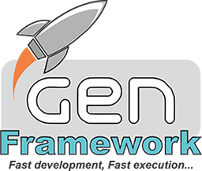

## What is GEN FrameWork?

GEN is a small multiplatform framework for the development of applications in C/C++. The main objective of this framework is above all the portability between different hardware and/or operating systems.

- **It is a generic framework**, is developed to perform any type of application: Utilities, games, libraries, etc ... having great versatility of functions and modules by general use.
- **It is very, very portable**, being able to be used in multiple compilers and IDEs, both in old and modern versions. This allows great flexibility when making applications: you can program on almost any platform, for practically any platform.
- **It is in C/C++ developed**, since this language is one of the most supported in the different architectures and platforms, allowing in turn access to resources (memory, peripherals, etc ...) in the fastest and most accessible way possible.

## What functionalities does GEN FrameWork have?

**GEN Framework** offers a hundred functionalities, grouped by types. The most important are divided into 5 blocks, each one controlled by a factory of objects.

1. **Utilities** (Utils directory).  
This directory provides the modules with generic functionalities: Handling of strings (XString), Buffers (XBuffer), Vectors (XVector), files (XFile), maps (XMaps), sheduler and Tasks (XScheduler), Timers (XTimers), etc. ..
The modules are recognized by starting with the letter **X** : **X**String, **X**Buffer, **X**File, etc...
(The **X** comes originally from e**X**tended).  
2. **Data Input Output** (DataIO directory).  
These modules facilitate the functionality of connectivity: Streams over several physical layers: UART, Ethernet, Wifi, Bluetooth, I2C, SPI, ..., Internet protocols: NTP, SMTP, HTTP, device drives with temperature devices, humidity devices, Led screens, etc ...  
The Modules are recognized by starting with the letters "**DIO**: **DIO**Stream, **DIO**WebServer, **DIO**Ping, etc...
3. **Graphics** (Graphic directory).   
The modules in this directory provide graphic functions, both in 2D and 3D (OpenGL ES). GEN FrameWork has a 3D graphic engine with FONTS (truetype) management, bitmap graphics management (JPG, BMP, PNG, etc.), for graphic representation of user interfaces, windows, animations, etc ...
All modules start with the letters "**GRP**": **GRP**Screen, **GRP**Canvas, etc...
4. **Inputs** (Input directory).  
The modules in this directory control the functions of input and output devices such as mice, keyboards, touch screens, commands such as wiimote, ect ...
All modules start with the letters "**INP**": **INPKeyboard**, **INPMouse**, etc..
5. **Sounds** (Sound directory).
The modules of this directory control the functions of creation/reproduction of sounds supporting several formats: OGG, MP3, etc ...
All modules start with the letters "**SND**": **SND**Manager, **SND**Sample, etc...

GEN FrameWork also has various features such as:
- **Compression of data**: Zip, GZ, LZW, etc ...
- **Data encryption**: typical HASH functions (CRC32, SHA, MD5, etc ..) Symmetric encryption (AES, DES, Blowfish, etc ...) and Asymmetric (RSA).
- **DataBase SQL connector** with MySQL, SQLite, PosgresSQL.
- **Video playback**: Decode and play several video formats.

... and hundreds and hundreds of more features.

## What platforms does GEN Framework cover?

One of the fundamental objectives of GEN FrameWork is the protability, both between different compilers and IDEs as well as between different platforms.

Currently GEN FrameWork supports different operating systems:
- Windows 32/64 bits (XP, Vista, 7, 10)
- Linux (more distributions): Debian, Red Hat, Fedora, Ubuntu, etc...
- Linux Embedded: Rasbian, Armbian, etc...
- Android.

It has been tested with different IDEs: 
- Visual Studio  (6, .NET 2005, .NET 2008, .NET 2012, .NET 2015).
- GNU compilers.
- Borland Compilers (Builder).
- Eclipse.
- KDeveloped.
- IAR compiler.
- etc ..

In different physical Hardwares:
- All PC platforms: i386, amd64.
- ARM platforms: Raspberry Pi, Artila, GumStix, Orange Pi, Banana PI, etc ...
- ST Microcontrollers (STMFxxx).

Where you can not use "still" GEN FrameWork:
- There is no support in Apple devices: Mac OS and IOs (iPad, iPhone, etc.)
- In my house washing machine.

  "Although in the future we may also support this kind of devices ...     ;-)"
